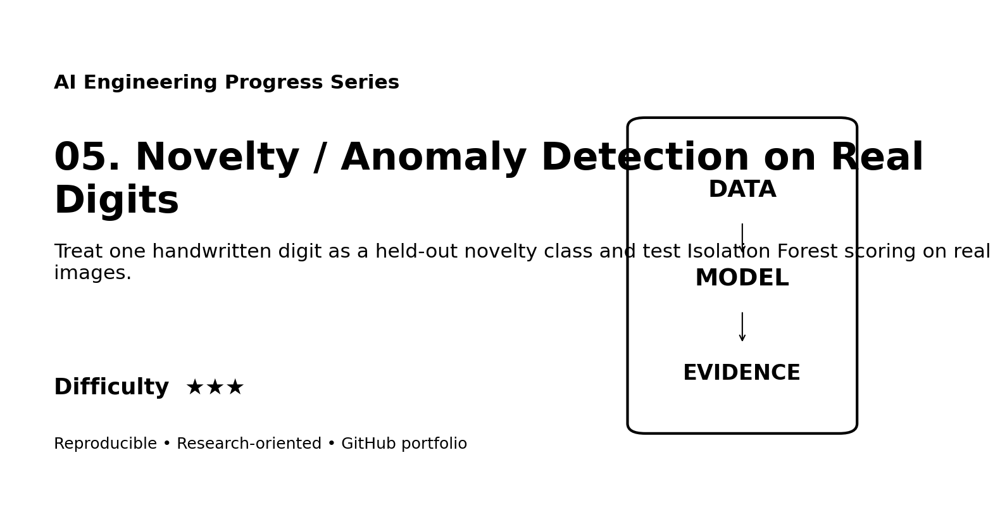
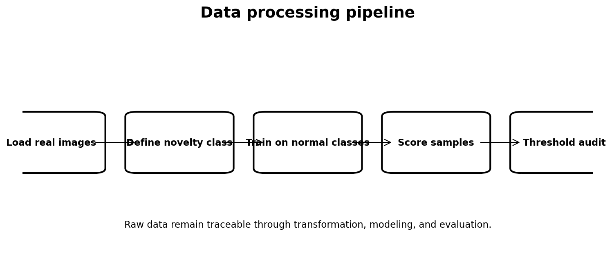
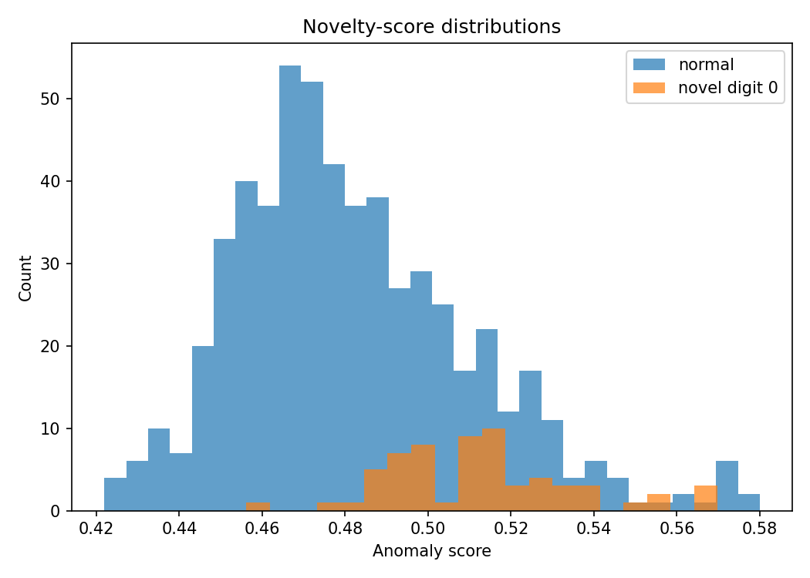
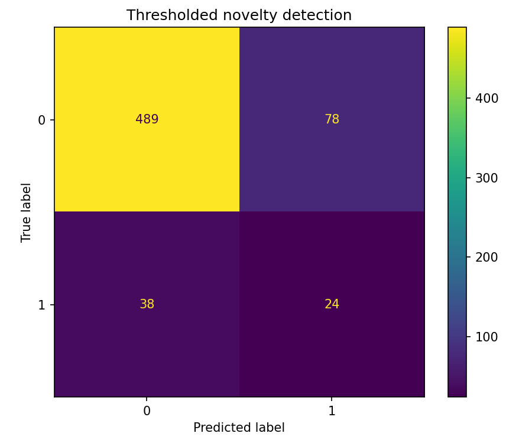

# Web Portfolio Card

## Novelty / Anomaly Detection on Real Digits

**Track:** AI Engineering  
**Difficulty:** ★★★  
**Dataset:** Optical Recognition of Handwritten Digits dataset  
**Quick description:** Treat one handwritten digit as a held-out novelty class and test Isolation Forest scoring on real images.

### Suggested website image gallery

### Suggested portfolio copy
This project demonstrates anomaly detection, novelty detection, Isolation Forest, ROC-AUC using a reproducible workflow with explicit data provenance, processing, evaluation, limitations, and research documentation. The repository includes executable code and a scientific-style technical report suitable for supervisor review.
