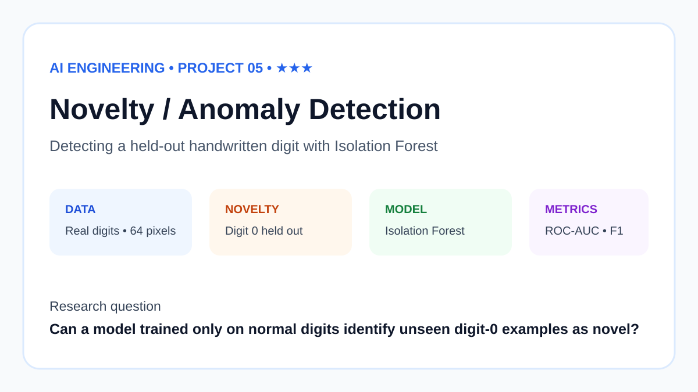
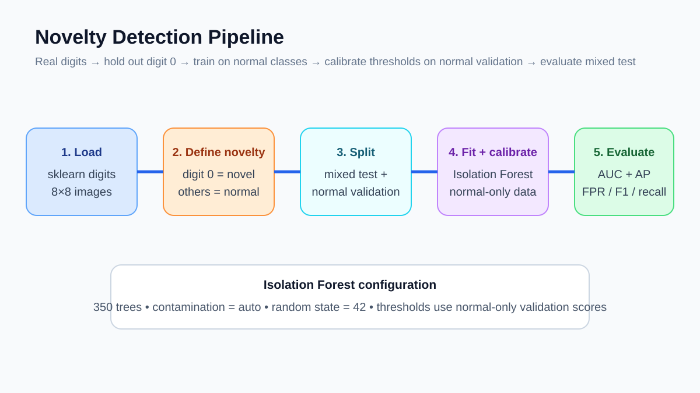
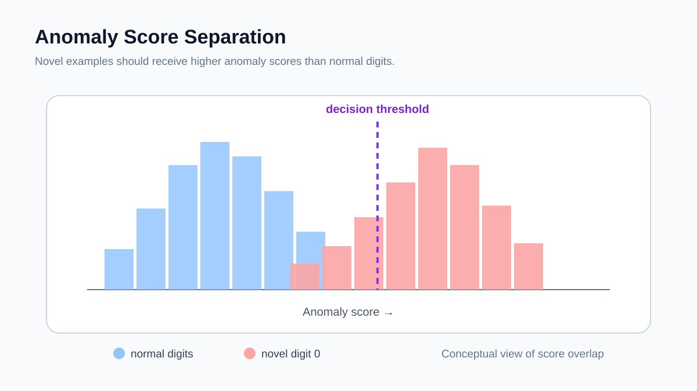
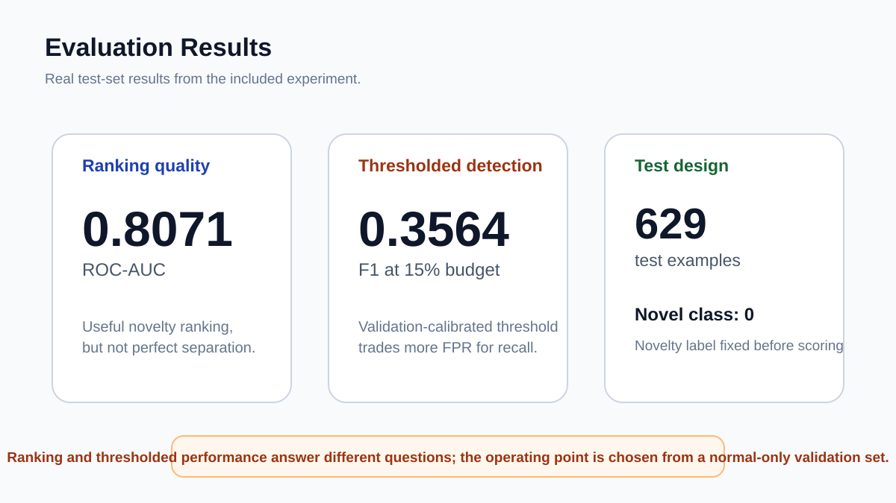

# Novelty Detection on Handwritten Digits



I built this project to test a different kind of machine-learning problem: instead of teaching a model all ten digit classes, I ask it to recognise when something looks unlike the data it was trained on.

Digit `0` is treated as the unseen class. The Isolation Forest is trained only on digits `1` through `9`.

## Data

I use scikit-learn's handwritten digits dataset.

- 1,797 grayscale images
- image size: 8 × 8
- 64 pixel features per image
- digit 0 is the novelty class

The train/test split is stratified on the novelty label. The test set contains 629 examples.

More detail is in [DATA.md](DATA.md).

## How the experiment works



The code:

1. labels digit 0 as novel and all other digits as normal;
2. creates a 65/35 train/test split;
3. removes every digit-0 sample from the training set;
4. fits an Isolation Forest with 350 trees;
5. uses the model's anomaly score to rank test examples;
6. evaluates ranking with ROC-AUC and thresholded predictions with F1.

The Isolation Forest uses `contamination=0.10` and `random_state=42`.

## Anomaly scores



Anomaly detection gives me two things to inspect: the ranking produced by the continuous anomaly score, and the final yes/no decision produced by a threshold.

Those two views can tell very different stories.

## Results



The recorded run produced:

| Metric | Result |
|---|---:|
| ROC-AUC | 0.8119 |
| F1 | 0.2927 |
| Test examples | 629 |

The ROC-AUC shows that the anomaly score contains useful information. The much lower F1 score shows that the default decision threshold is not well matched to this task.

That gap is the main lesson from this project. Ranking anomalies and choosing a practical threshold are separate problems.

## Run it

```bash
python -m venv .venv
source .venv/bin/activate
pip install -r requirements.txt
python src/run_experiment.py
```

On Windows, use `.venv\Scripts\activate`.

## Repository notes

- [DATA.md](DATA.md) explains the dataset.
- [REPRODUCIBILITY.md](REPRODUCIBILITY.md) records the experiment settings.
- [paper/paper.md](paper/paper.md) contains the longer write-up.
